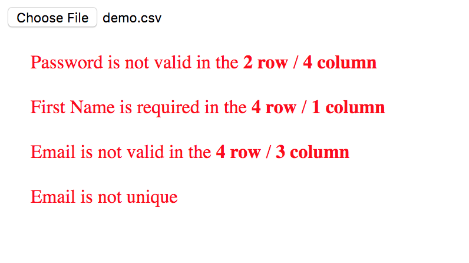

# CSV File Validator [](https://twitter.com/intent/tweet?hashtags=javascript&original_referer=https%3A%2F%2Fpublish.twitter.com%2F&ref_src=twsrc%5Etfw&text=Validation%20of%20CSV%20file%20against%20user%20defined%20schema%20(returns%20back%20object%20with%20data%20and%20invalid%20messages)&tw_p=tweetbutton&url=https%3A%2F%2Fwww.npmjs.com%2Fpackage%2Fcsv-file-validator&via=shystrukk) #
[](https://opensource.org/licenses/mit-license.php)
[](https://codecov.io/gh/shystruk/csv-file-validator)
[](https://travis-ci.org/shystruk/csv-file-validator)
[](https://snyk.io/test/github/shystruk/csv-file-validator?targetFile=package.json)
[](https://badge.fury.io/js/csv-file-validator)

Validation of CSV file against user defined schema (returns back object with data and invalid messages)

## Getting csv-file-validator ##

#### npm
`npm install --save csv-file-validator`

#### yarn
`yarn add csv-file-validator --save`

## Example ##
```javascript
import CSVFileValidator from 'csv-file-validator'

CSVFileValidator(file, config)
    .then(csvData => {
        csvData.data // Array of objects from file
        csvData.inValidMessages // Array of error messages
    })
    .catch(err => {})
```

Please see **Demo** for more details **/demo/index.html**



## API ##
### CSVFileValidator(file, config) ###
returns the Promise

## file ##
Type: `File` <br>

.csv file

## config ##
Type: `Object` <br>

Config object should contain:<br>
**headers** - Type: `Array`, row header (title) objects<br>
**isHeaderNameOptional** - Type: `Boolean`, skip the header name if it is empty<br>

```javascript
const config = {
    headers: [], // required
    isHeaderNameOptional: false // default (optional)
}
```

### name
Type: `String` <br>
name of the row header (title)

### inputName
Type: `String` <br>
key name which will be return with value in a column

### optional
Type: `Boolean` <br>

Makes column optional. If true column value will be return

### headerError
Type: `Function` <br>

If a header name is omitted or is not the same as in config *name* headerError function will be called with arguments
**headerName**

### required
Type: `Boolean` <br>

If required is true than a column value will be checked if it is not empty

### requiredError
Type: `Function` <br>

If value is empty requiredError function will be called with arguments
**headerName, rowNumber, columnNumber**

### unique
Type: `Boolean` <br>

If it is true all header (title) column values will be checked for uniqueness

### uniqueError
Type: `Function` <br>

If one of the header value is not unique uniqueError function will be called with argument **headerName**

### validate
Type: `Function` <br>

Validate column value. As an argument column value will be passed
For e.g.
```javascript
function(email) {
    return isEmailValid(email)
}
```

### validateError
Type: `Function` <br>

If validate returns false validateError function will be called with arguments **headerName, rowNumber, columnNumber**

### isArray
Type: `Boolean` <br>

If column contains list of values separated by comma in return object it will be as an array

#### Config example ####
```javascript
const config = {
    headers: [
        {
            name: 'First Name',
            inputName: 'firstName',
            required: true,
            requiredError: function (headerName, rowNumber, columnNumber) {
                return `${headerName} is required in the ${rowNumber} row / ${columnNumber} column`
            }
        },
        {
            name: 'Last Name',
            inputName: 'lastName',
            required: false
        },
        {
            name: 'Email',
            inputName: 'email',
            unique: true,
            uniqueError: function (headerName) {
                return `${headerName} is not unique`
            },
            validate: function(email) {
                return isEmailValid(email)
            },
            validateError: function (headerName, rowNumber, columnNumber) {
                return `${headerName} is not valid in the ${rowNumber} row / ${columnNumber} column`
            }
        },
        {
            name: 'Roles',
            inputName: 'roles',
            isArray: true
        },
        {
            name: 'Country',
            inputName: 'country',
            optional: true
        }
    ]
}
```

## Contributing

Any contributions you make **are greatly appreciated**.

Please read the [Contributions Guidelines](CONTRIBUTING.md) before submitting a PR.

## License

MIT © [Vasyl Stokolosa](https://about.me/shystruk)
